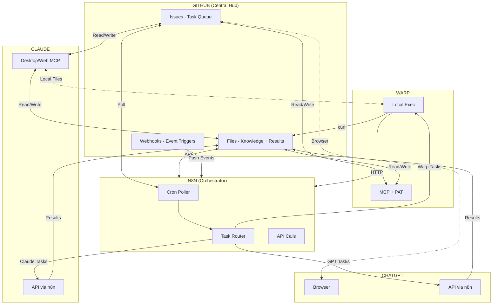

# Connectivity Diagram

## Mermaid Source

## Connection Legend

| Symbol | Meaning |
|--------|--------|
| Solid line | Direct API/MCP |
| Dashed line | Indirect/Browser |
| Arrow | Data flow direction |

## Key Insight

**n8n is the only platform that:**
- Runs persistently (24/7)
- Receives webhooks
- Can orchestrate all other agents

**GitHub is the only platform that:**
- All agents can access
- Provides persistent state
- Acts as task queue + knowledge base